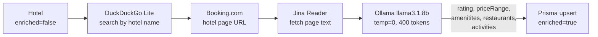

# Marriott Lumina AI Concierge 🏨✨

Marriott Lumina is an **AI-powered hotel concierge** for the global Marriott Bonvoy portfolio. Guests ask questions in natural language and get real hotel data — ratings, prices, amenities, and dining — sourced from Booking.com and enriched locally.

The app supports two orchestration modes, toggled via a single environment variable:

| Mode | Variable | Route | Description |
|---|---|---|---|
| **WorkflowManager** | `NEXT_PUBLIC_USE_AGENT=false` | `POST /api/chat` | Hand-coded multi-step pipeline using two sequential LLM calls |
| **Agentic Workflow** | `NEXT_PUBLIC_USE_AGENT=true` | `POST /api/agent` | Claude Console managed-agent loop — Claude drives its own tool calls |

---

## Table of Contents

- [Features](#-features)
- [Technology Stack](#️-technology-stack)
- [Setup & Installation](#️-setup--installation)
- [Orchestration Mode 1 — WorkflowManager](#-orchestration-mode-1--workflowmanager)
- [Orchestration Mode 2 — Agentic Workflow](#-orchestration-mode-2--agentic-workflow)
- [Switching Between Modes](#-switching-between-modes)
- [Database & Enrichment](#-database--enrichment)
- [Security](#-security)

---

## 🚀 Features

- **9,872-Hotel Directory** — pre-seeded from the official Marriott sitemap. Every response is grounded in this directory — no hallucinated hotels.
- **Per-Hotel Booking.com Enrichment** — each hotel is individually scraped by name with real check-in dates for accurate pricing, enriched once, and marked `enriched=true` permanently.
- **Background Enrichment** — first query for a city returns basic results immediately while enrichment runs in the background. Subsequent queries get full ratings, prices, amenities, and descriptions.
- **Tier Diversity** — responses always show one hotel from each available Marriott tier rather than a list from a single category.
- **Location Disambiguation** — understands that "Paris" means France, not Texas. Country is inferred from context.
- **Adaptive Preferences** — learns guest likes/dislikes during the conversation and tailors recommendations automatically.
- **Persistent Conversation Memory** *(Agentic mode only)* — the agent remembers the full conversation within a session. Follow-up questions like "what museums are nearby?" correctly reference the city discussed earlier.
- **Official 6-Tier Classification**:
  - **Luxury**: JW Marriott, Ritz-Carlton, St. Regis
  - **Distinctive Luxury**: EDITION, W Hotels, The Luxury Collection
  - **Premium**: Marriott Hotels, Westin, Sheraton, Le Méridien, Renaissance
  - **Select**: Courtyard, Moxy, AC Hotels, Aloft, Four Points, Fairfield
  - **Longer Stays**: Residence Inn, Element, TownePlace Suites
  - **Collections**: Autograph Collection, Design Hotels, Tribute Portfolio

---

## 🛠️ Technology Stack

| Layer | Technology |
|---|---|
| Framework | Next.js 15 (App Router) |
| Orchestration (WorkflowManager) | Claude Haiku — two sequential LLM calls per turn |
| Orchestration (Agentic) | Claude Console Managed Agents — native tool-call loop |
| Enrichment AI | Ollama `llama3.1:8b` (local, free — no rate limits) |
| Data Discovery | DuckDuckGo Lite → Booking.com hotel pages → Jina Reader |
| Database | Prisma ORM + SQLite |
| Styling | Vanilla CSS (custom Marriott brand system) |

---

## 🏗️ Setup & Installation

### 1. Clone the repository

```bash
git clone https://github.com/kethanpabbi/Marriott-Agent.git
cd Marriott-Agent
```

### 2. Install dependencies

```bash
npm install
```

### 3. Install Ollama

Ollama runs hotel enrichment locally — no API costs, no rate limits.

```bash
# Install from https://ollama.com, then pull the model:
ollama pull llama3.1:8b
```

### 4. Environment configuration

Create `.env.local`:

```env
# LLM
ANTHROPIC_API_KEY=your_anthropic_api_key
LLM_PROVIDER=claude

# Ollama (enrichment)
OLLAMA_BASE_URL=http://localhost:11434

# Database
DATABASE_URL="file:./prisma/dev.db"

# Orchestration toggle
# true  → Agentic Workflow  (Claude Console managed-agent loop)
# false → WorkflowManager   (hand-coded pipeline)
NEXT_PUBLIC_USE_AGENT=false

# --- Required only when NEXT_PUBLIC_USE_AGENT=true ---
# Create an agent at platform.claude.com, paste its ID in /api/agent/route.ts
# The environment ID is auto-created on first run and logged to the console.
ANTHROPIC_ENVIRONMENT_ID=
# Expose your local server via ngrok so the agent route can make self-calls
NEXT_PUBLIC_APP_URL=https://your-ngrok-url.ngrok-free.app
```

Create `.env` (for Prisma CLI):

```env
DATABASE_URL="file:./prisma/dev.db"
```

### 5. Initialize the database

```bash
npx prisma db push
npx prisma db seed
```

The seed script populates the 9,872-hotel directory from the Marriott sitemap.

### 6. Start Ollama

```bash
ollama serve
```

### 7. Launch

```bash
npm run dev
```

Open [http://localhost:3000](http://localhost:3000) and start chatting.

### 8. Database viewer (optional)

```bash
npx prisma studio
```

Opens at [http://localhost:5555](http://localhost:5555) — browse hotels, users, chat history, and enrichment status.

---

## 🔁 Orchestration Mode 1 — WorkflowManager

**Route:** `POST /api/chat`
**Toggle:** `NEXT_PUBLIC_USE_AGENT=false`

The original orchestration approach. Every step is hand-coded inside `WorkflowManager.processQuery()`. The app makes two explicit LLM calls per turn: one to reason about the query and extract structured data, one to generate the final response.

### Step-by-step

1. **Rate limit** — request is checked against an in-memory rate limiter.
2. **Security check** — `UserAgent.checkSecurity()` scans the query for prompt injection patterns. Flagged users are blocked immediately.
3. **Load context** — chat history (last 5 turns) and the guest's preference profile are fetched from the DB in parallel.
4. **Reasoning LLM call** — Claude Haiku receives a structured prompt and must return a strict JSON object: `inScope`, `activeLocation`, `activeCountry`, `isSpecificHotelQuery`, `specificHotelName`, `isBudgetQuery`, `userProfileUpdate`.
5. **Preference update** — any new likes/dislikes extracted from the reasoning step are merged and persisted to the guest profile.
6. **Background enrichment** — if the location hasn't been enriched yet, `HotelsAgent.syncLocation()` fires asynchronously. Ollama scrapes Booking.com for each hotel in the city.
7. **Hotel search** — `HotelsAgent.searchHotels()` queries the local SQLite DB, filtered by location and country.
8. **Tier selection** — `pickOnePerTier()` selects the best hotel from each available Marriott tier (by rating, or by price for budget queries).
9. **Response LLM call** — Claude Haiku generates a branded, tier-grouped reply using the retrieved hotels as grounding context.
10. **Persist** — the user message and assistant reply are written to the DB.

### Data flow

```mermaid
flowchart TD
    A([Browser]) -->|POST /api/chat\n{ email, query }| B[/api/chat]
    B --> C{Rate limit}
    C -->|Blocked| Z1([429])
    C -->|OK| D[checkSecurity]
    D -->|Flagged| Z2([Blocked])
    D -->|Safe| E[Load context in parallel]
    E --> E1[getChatHistory\nlast 5 turns]
    E --> E2[getOrCreateUser\npreference profile]
    E1 & E2 --> F[LLM Call 1\nReasoning — Claude Haiku]
    F -->|JSON: location, country,\nisBudget, preferences| G{inScope?}
    G -->|No| Z3([Out of scope reply])
    G -->|Yes| H[Update preferences]
    H --> I[syncLocation\nfire-and-forget]
    I -.->|background| J[[Ollama enrichment\nBooking.com scrape]]
    H --> K[searchHotels\nSQLite query]
    K --> L[pickOnePerTier\nbest per tier]
    L --> M[LLM Call 2\nResponse — Claude Haiku]
    M --> N[Parse SUGGESTIONS block]
    N --> O[logInteraction]
    O --> P([{ response, suggestions }])
```

### Limitations

| Issue | Detail |
|---|---|
| Two LLM calls per turn | Reasoning + response run sequentially — adds 2–4 s latency |
| Fragile JSON parsing | Reasoning step requires exact JSON from the model. Any preamble breaks the parse and falls back to defaults, silently losing location context |
| No native conversation memory | Last 5 DB messages are re-injected as plain text each turn — the LLM has no true session |
| Hand-coded orchestration | Adding a new capability means new WorkflowManager logic, new prompt rules, and new JSON fields |

---

## 🤖 Orchestration Mode 2 — Agentic Workflow

**Route:** `POST /api/agent`
**Toggle:** `NEXT_PUBLIC_USE_AGENT=true`
**Branch:** `feat/agentic-workflow`

This mode replaces WorkflowManager with a Claude Console **Managed Agent**. The agent (Marriott Lumina) is configured on [platform.claude.com](https://platform.claude.com) with a system prompt and three custom tools. It decides what to call, in what order, and when it's done — no hand-coded orchestration.

The Next.js app drives the tool-call loop over the Console's SSE event stream.

### Tools

| Tool | What it does | Backed by |
|---|---|---|
| `get_user_profile` | Reads the guest's saved likes/dislikes | `UserAgent.getOrCreateUser()` |
| `search_hotels` | Queries the hotel directory filtered by location, country, budget. Returns one hotel per tier. | `HotelsAgent.searchHotels()` + `pickOnePerTier()` |
| `update_preferences` | Persists expressed preferences to the guest profile | `UserAgent.updatePreferences()` |

Tools are executed directly in-process — no HTTP roundtrip to the internal API routes.

### Session continuity

Each browser tab holds a `managedSessionId`. The first message creates a new Console session; every subsequent message reuses it. The agent has full native conversation memory — no history re-injection needed. Page reload starts a fresh session.

### Event loop

```
Open SSE stream (before sending message — stream-first pattern)
  ↓
Send user.message event
  ↓
Drain event stream:
  agent.custom_tool_use        → collect tool call
  agent.message                → accumulate response text
  session.status_idle
    requires_action + new calls  → execute tools, open new stream, send results, repeat
    requires_action + no calls   → intermediate idle, keep listening on same stream
    end_turn                     → agent finished, break
  session.status_terminated    → break
```

> **Key detail:** the server processes batched tool results one at a time, emitting an intermediate `session.status_idle(requires_action)` after each one. The loop continues listening through these intermediate idles and only exits on `end_turn` or `retries_exhausted`.

### Data flow

```mermaid
flowchart TD
    A([Browser]) -->|POST /api/agent\n{ email, query, managedSessionId? }| B[/api/agent]

    B --> C{managedSessionId\nprovided?}
    C -->|Yes| D[Reuse existing\nConsole session]
    C -->|No - first message| E[Create new\nConsole session]
    E --> D

    D --> F[Open SSE stream\nstream-first]
    F --> G[Send user.message\nto session]

    G --> H{Drain event stream}
    H -->|agent.thinking\nspan.model_request_*\nsession.status_running| H

    H -->|agent.custom_tool_use| I[Collect tool calls]
    I --> H

    H -->|agent.message| J[Accumulate\nresponse text]
    J --> H

    H -->|session.status_idle\nrequires_action, no new calls\nintermediate idle| H

    H -->|session.status_idle\nrequires_action + new tool calls| K[Execute tools\nin parallel]

    K --> K1[get_user_profile\nUserAgent directly]
    K --> K2[search_hotels\nHotelsAgent directly\n+ pickOnePerTier]
    K --> K3[update_preferences\nUserAgent directly]

    K1 & K2 & K3 --> L[Open new SSE stream]
    L --> M[Send tool results\nto session]
    M --> H

    H -->|session.status_idle\nend_turn| N[Parse SUGGESTIONS]
    H -->|session.status_terminated| N

    N --> O[getOrCreateUser\nFK guard]
    O --> P[logInteraction]
    P --> Q([{ response, suggestions,\nmanagedSessionId }])

    Q -->|stored in React state| A
```

### Comparison with WorkflowManager

| | WorkflowManager | Agentic Workflow |
|---|---|---|
| LLM calls per turn | 2 (reasoning + response) | 1 (agent loop) |
| Orchestration logic | Hand-coded TypeScript | Claude decides |
| Conversation memory | 5-turn re-injection | Native session memory |
| JSON parsing risk | High — strict schema | None |
| Adding new tools | Rewrite WorkflowManager | Add tool on Console |
| Context across turns | Loses context on parse fail | Always retained |

---

## 🔀 Switching Between Modes

Change one line in `.env.local` and restart the dev server (`NEXT_PUBLIC_` vars are baked in at build time):

```env
NEXT_PUBLIC_USE_AGENT=true   # → Agentic Workflow (Claude Console)
NEXT_PUBLIC_USE_AGENT=false  # → WorkflowManager  (local pipeline)
```

Both routes are always present in the codebase. Only the frontend fetch target changes.

> **Note:** Agentic mode requires ngrok running and `NEXT_PUBLIC_APP_URL` set. WorkflowManager works without ngrok.

---

## 🗄 Database & Enrichment

The SQLite DB lives at `prisma/dev.db` and is gitignored. It contains:

| Table | Contents |
|---|---|
| `Hotel` | 9,872 properties — name, brand, location, country, tier, rating, priceRange, amenities, restaurants, activities, `enriched` flag |
| `User` | Guest profiles — likes, dislikes, isFlagged, interaction count |
| `Message` | Full chat history per user |
| `Attraction` | Nearby points of interest linked to hotels |

### Enrichment pipeline

When a city is queried for the first time, `HotelsAgent.syncLocation()` runs in the background:



Hotels are enriched once and never re-processed. A module-level `Set` prevents concurrent enrichment runs for the same location.

---

## 🔒 Security

- **Scope enforcement** — hotel searches, property info, and travel questions are in scope. Unrelated topics are rejected at the WorkflowManager reasoning step or by the agent's system prompt.
- **Source-locked data** — only hotels in the 9,872-property directory can appear in responses. The agent is instructed never to mention hotels not in the grounding context.
- **Injection defence** — `UserAgent.checkSecurity()` scans all queries for prompt injection patterns before any LLM call is made.
- **Rate limiting** — the `/api/chat` route applies an in-memory rate limiter per IP.
- **In-flight deduplication** — a module-level `Set` prevents concurrent enrichment runs for the same location.

---

Built as a POC for Marriott International.
